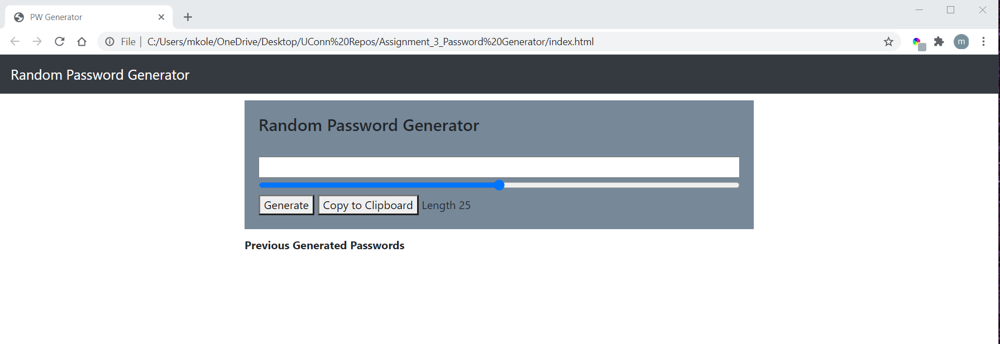

In this assignment we were instructed to make a random password generator. 

I was confused and stuck on how to start. So I started by GOogle searching how others have created this and watched a bunch of videos and tutorials on how to go about it and followed along with one video as he walked through the process he used to create the HTML / CSS / Java Script files and mimicked their code as I followed along changing bits to make the generator more along what I had envisioned.

